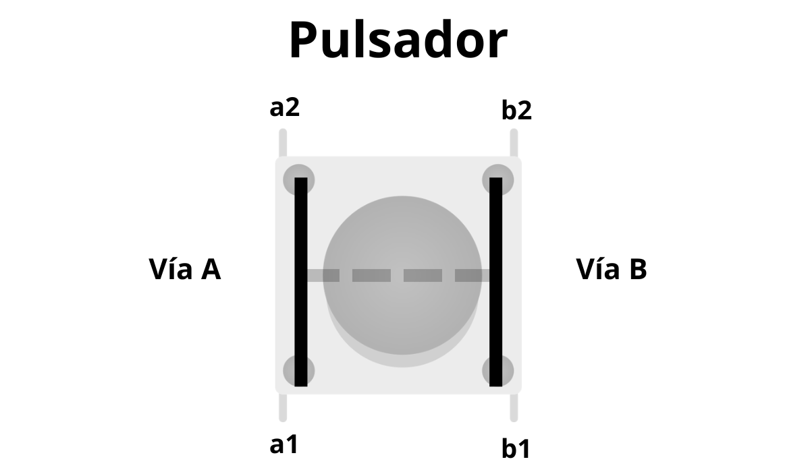

# 🔘 Botón Pulsador

Un pulsador parece un componente super sencillo, pero a mí me pasó que lo dejé como que lo entendía y cuando empecé a montar un circuito con él para que mande señal a la placa, me di cuenta de que no sabia como funcionaba , aqui ahora te explico cómo funciona para que no te pase lo mismo.

---

### Funcionaminto

Un pulsador de **4 pines** se podría decir que tiene **dos vias** , Via A y Vía B.  
 
Un pulsador normalmente viene abierto, es decir, que no pasa la corriente, pero cuando nosotros pulsamos el botón, hacemos que cada vía se conecte, y también una cosa es que los pulsadores tienen un puente en el medio que conecta los 4 pines, solo cuando lo pulsas.

En esta imagen creada por mi puedes ver todo mas visual. 

---

### Cómo conectar los cables en diagonal:
Para no equivocarte nunca, conectamos los cables cruzados usando las letras de mi esquema:
* El cable de información (`D4`) lo conectamos en la pata **a2**.
* El cable de masa (`GND`) o la resistencia al negativo lo conectamos en la pata **b1**.
