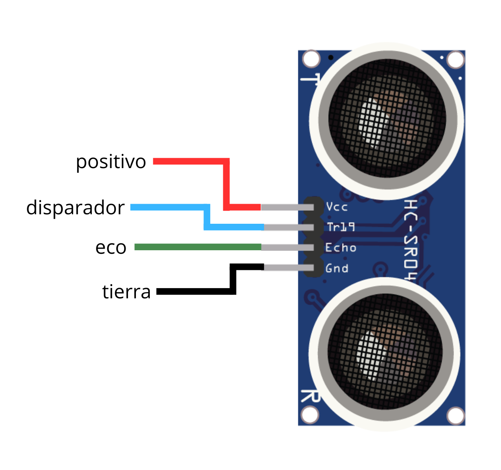
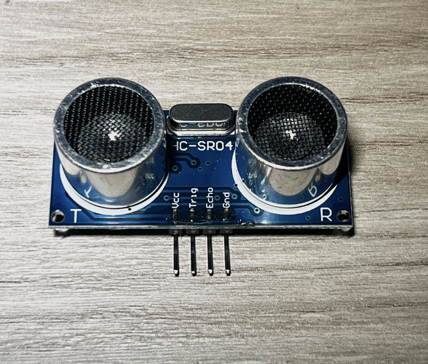

# HC-SR04 | Sensor de Ultrasonidos
> **Autor:** David Montero Feito 
> **Fecha:** 11 de Junio 2026

##  Descripción General
Un sensor digital diseñado para **medir distancias** (entre 2 cm y 400 cm) utilizando el eco del sonido, imitando el sistema de orientación de los murciélagos.

##  Especificaciones
* **Voltaje de operación:** 5V modelos antiguos. 3.3V modelos modernos
* **Consumo:** 15 mA.
* **Resistencia interna:** Ya viene protegido de fábrica. **No necesita resistencia externa**.

## Conexiones de Pines 

Esta es una imagen creada por mi donde te dice que pin es cada cosa

| Pin      | Color del Cable | Función           | ¿A dónde se conecta? |
| :--- | :--- | :--- | :--- |
| **VCC**  | 🔴 Rojo        | Alimentación (+)   | Pin de energía |
| **TRIG** | 🔵 Azul        | Disparador (Señal) | Pin Digital |
| **ECHO** | 🟢 Verde       | Eco (Señal)        | Pin Digital |
| **GND**  | ⚫ Negro       | Tierra (-)         | GND/Tierra |

##  Funcionamiento

1. La placa envía un pulso eléctrico por el pin **TRIG**.
2. El sensor dispara ondas de sonido ultrasónico al aire.
3. El sonido choca contra el objeto y rebota hacia el sensor.
4. Al recibir el eco, el pin **ECHO** se activa.
5. El procesador calcula el tiempo del viaje y lo **divide entre 58** para obtener los centímetros reales.

##  Imagen

