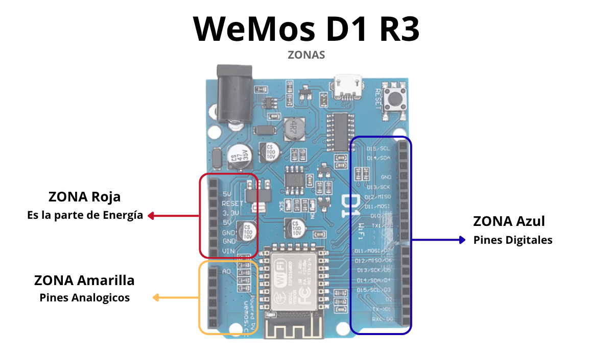
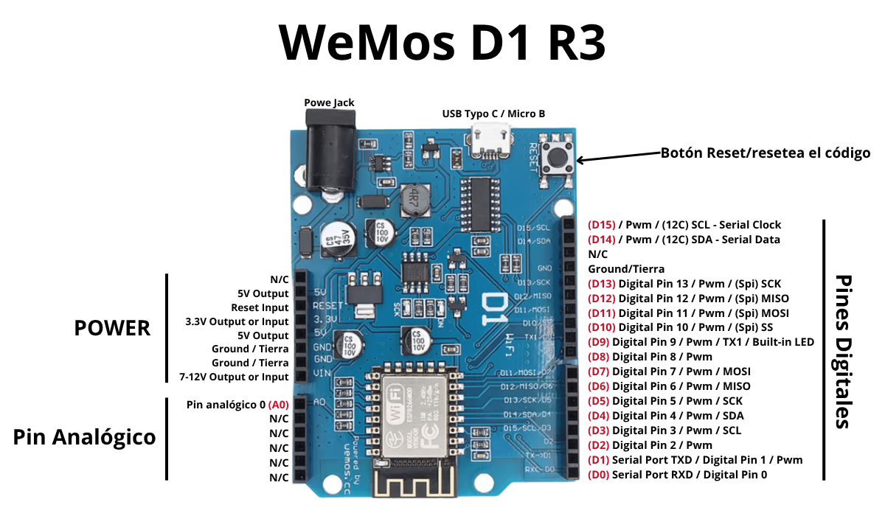

# WeMos D1 UNO R3

La **WeMos D1 R3** es el núcleo de todos mis circuitos. Aunque físicamente tiene el mismo tamaño y formato que un Arduino UNO normal, por dentro es muchísimo más potente porque cuenta con un chip **ESP8266** que le añade conexión **Wi-Fi** integrada.

---

### 🔀 ¿Quién comparte cable con quién? 

Una cosa antes de todo, quería aclarar una cosa que tiene mal esta placa, que aunque haya 15 pines, en teoría son 11 porque hay unos que son el mismo. Es decir que son como duplicados, aquí te digo cuáles son para que no pongas cosas independientes:  

* 🟢 **`D3` <---> `D15`** (Comparten la función de reloj `SCL`)
* 🔵 **`D4` <---> `D14`** (Comparten la función de datos `SDA`)
* 🟡 **`D5` <---> `D13`** (Comparten la función de reloj `SCK`)
* 🟠 **`D6` <---> `D12`** (Comparten la función de datos `MISO`)
* 🔴 **`D7` <---> `D11`** (Comparten la función de datos `MOSI`)

---

### Especificaciones Técnicas 

| Característica | Detalle Técnico | ¿Qué significa? |
| :--- | :--- | :--- |
| **Microcontrolador** | ESP-8266EX | El chip principal encargado de procesar todo tu código. |
| **Voltaje de Trabajo** | `3.3V` |  Los pines de la placa mueren si les metes 5V. Todo va a 3.3V. |
| **Voltaje de Entrada** | `7V a 12V` | Lo que soporta si la alimentas por el conector Jack negro. |
| **Pines Digitales** | 11 pines (D0 a D15) | Los caminos para conectar tus LEDs, botones y sensores. |
| **Pin Analógico** | 1 pin (A0) | Solo tiene uno, y soporta una entrada máxima de `3.2V`. |
| **Conectividad** | Wi-Fi 802.11 b/g/n | Permite conectar la placa a internet o controlarla desde el móvil. |
| **Lenguaje** | C++ | Se programa usando el mismo entorno oficial de Arduino IDE. |

---

### ZONAS de la Placa WeMos D1 R3

He hecho esta imagen con las zonas de la placa para que primero veas visualmente cómo es la placa y sus zonas.

### Guía Visual de Conexiones

Aquí te voy a decir mis recomendaciones de qué se usa en cada zona y que hay:

1. **Zona POWER :** Aquí sacas la energía para la protoboard. Usa el pin `3.3V` para dar corriente y los pines `GND` para el polo negativo **tierra**.

2. **Zona Pines Digitales:** Aquí van los cables de control. Por ejemplo, las LEDs,los sensores sirve para dar corriente `1` o no dar `0`. Haber peudes usar todos los pines digitales pero yo recomendaria estos `D2`, `D4`, `D5`, `D6` y `D7`, son los mas limpios para que no se congele nada.
3. **Botón Reset:** Sirve para reiniciar el código desde el principio si la placa se queda congelada.

---

### Precauciónes de la placa

Siempre hay que tomar precaucciones estas son las mas importantes:

* **La regla de los 3.3V:** Siempre, siempre, siempre tienes que saber que la placa solo puede obtener señal de otros componentes hasta `3.3V`, aunque tenga un pin de `5V` es solo para alimentar otras cosas de `5V`, pero la señal máxima que tiene es de `3.3V`.
* **Usa siempre resistencias con los LEDs:** Los LEDs usan mucha corriente y, si no usas resistencia para que no se fundan, quemarás el canal del pin y el LED; por eso siempre usa resistencias en las cosas que hagan falta.

---

### Como conectar y desconectar la placa: 

- Para **conectar** la placa, siempre tienes que conectar primero el cable tipo C en la **PLACA** y luego al PC.  
🔗 **Placa ---> PC**

- Para **desconectar** la placa, siempre tienes que desconectar del PC y luego de la placa, si quieres de la placa.  
🔌 **PC ---> Placa**

---

**¿Qué pasa con las letras raras de los pines?**  
Si miras la placa, verás que al lado de pines como `D4` o `D5` pone cosas raras como `SDA` o `SCK`. No te líes, son para conectar cosas en concreto los ponen para que vaya mejor en esos pines pero se pueden usar igualmente a la perfección.  

Te pongo aqui para que es cada cosa por si los utilizas algun dia pero es **Nivel Azanzado:**

Como bien te dije al principio, hay pines que son los mismos internamente, así que ten cuidado.

| Pin Digital | Nombre Secundario | ¿Para qué sirve concretamente? |
| :--- | :--- | :--- |
| `D0` | **RXD** | Canal principal para recibir datos del PC (se usa cuando subes el código desde el ordenador). |
| `D1` | **TXD** | Canal principal para enviar datos al PC (se usa para ver el Monitor Serie). |
| `D2` | **D2** | Pin digital limpio de propósito general . |
| `D3` | **SCL** | Segunda opción de reloj para pantallas OLED pequeñas. |
| `D4` | **SDA**  | Segunda opción de canal de datos para pantallas OLED pequeñas. |
| `D5` | **SCK**  | Segunda opción de reloj para sincronizar componentes tipo SPI. |
| `D6` | **MISO**  | Segunda opción de canal para recibir datos de pantallas SPI o tarjetas de memoria. |
| `D7` | **MOSI** | Segunda opción de canal para enviar datos a pantallas SPI o tarjetas de memoria. |
| `D8` | **D8** | Pin digital limpio de propósito general (no tiene funciones raras especiales). |
| `D9` | **TX1** | Canal de transmisión para conectar una segunda placa u otro chip por puerto Serie. |
| `D10` | **SS** | Selector para activar o desactivar la tarjeta SD cuando hay varios componentes. |
| `D11` | **MOSI** | Canal por donde la placa le envía datos para guardar en la tarjeta SD. |
| `D12` | **MISO** | Canal por donde la tarjeta SD le envía los datos leídos a la placa. |
| `D13` | **SCK** | Reloj de sincronización para lectores de tarjetas SD o llaveros RFID. |
| `D14` | **SDA** | Canal de datos para pantallas y sensores I2C *(Trabaja junto con D15)*. |
| `D15` | **SCL** | Reloj para pantallas OLED, pantallas LCD avanzadas o sensores I2C. |

