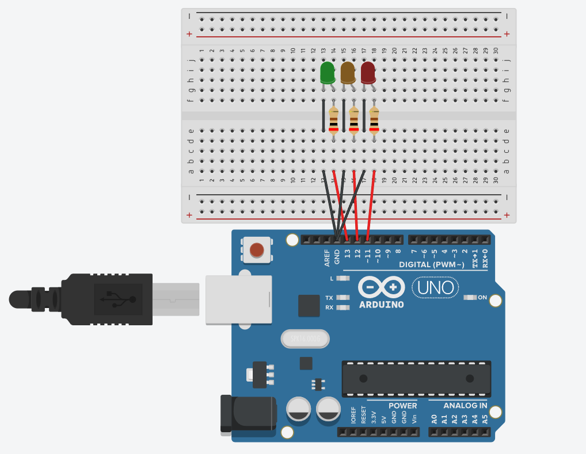

# Proyecto 01: Traffic Light

Este es mi primer proyecto simulado en Tinkercad. Antes de todo tendra mejoras progresivas

### Cómo funciona:

* Básicamente caundo le das a Iniciar se enciende en orden cada luz durante 6000 milisegundos
* Primero con la led verde, 6 segundos encendida y se apaga.
* Segundo con la led naranja, 6 segundos encendida y se apaga.
* Tercero con la led roja, 6 segundos encendida y se apaga.
* Y otra vez a comenzar es todo el rato este bucle.

*Como bien he dicho tendra mejoras.

### Simulación del Circuito::

