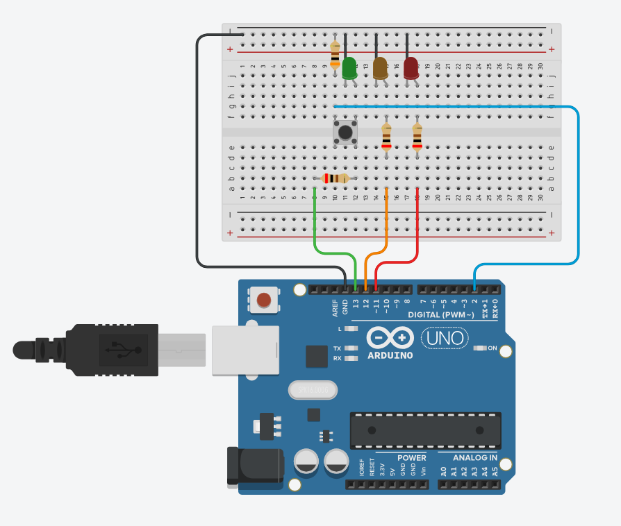

# v2.0
# Proyecto 01: Traffic Light

Estas son las mejoras implementadas, son inportates ya que añade algo nuevo que es usar el INPUT
Es decir que el arduino leea el boton para ver si pasa la corriente o no y si poner la luz en rojo o en verde.

### Cómo funciona:

* Ahora a cambiado, si le das al boton haces que leea el arduino 1 y hace que
* Apaga el verde y enciende el naranja 3 seg.
* Apaga el naranga y enciede el rojo 6 seg.
* Cuando termina enciende directamente el verde para que pase los coches
* Asi se crea un semaforo inteligente caundo le das al boton.

*Alomejor hay mejoras no se sabe.

### Simulación del Circuito::

