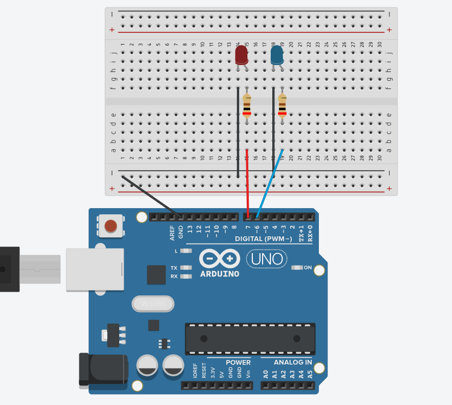

# v1.0
# 🚨 Proyecto 02: Police Lights

Este proyecto lo he creado para aprender muchas cosas, como manejar la programación con muchas más funciones y sincronizar las luces como si fuera una alarma de policía todo el rato encendida. Este proyecto también lo he creado porque le voy a poner muchas más mejoras.

---

### 🛠️ Componentes utilizados

* **1x Placa de desarrollo**
* **1x LED Rojo:**
* **1x LED Azul:**
* **2x Resistencias:** De 220 Ohms 
* **Cables de conexión y Protoboard.**

---

### 🔌 Conexiones del Circuito

1. **Positivo:** Los mismos cables de los pines digitales dan la corriente, pones una resistencia en cada LED de 220Ω / 330Ω para proteger los LEDs.
2. **Negativo (Tierra):** Lo que hice es coger dos cables y conectarlos desde los LEDs hasta la línea del negativo y después un cable de la línea del negativo hasta la placa.
3. **Control LED Rojo:** Conecto un cable rojo desde el pin digital `D7` hasta el ánodo del LED rojo.
4. **Control LED Azul:** Conecto un cable azul desde el pin digital `D6` hasta el ánodo del LED azul.



---

### El Código : creado por mi

Este es el código que he desarrollado para controlar el parpadeo. Lo que hago es encender el rojo mientras el azul está apagado, esperar un instante muy corto (`100ms`) para que parpadee rápido, apagarlo, y luego hacer exactamente lo mismo con el azul.

```cpp
//C++
int ledRed = D7;
int ledBlue = D6;

void setup()
{  
  pinMode(ledRed,OUTPUT);
  pinMode(ledBlue, OUTPUT);
}

void loop()
{
// Led Red
digitalWrite(ledRed,HIGH);
delay(100);
digitalWrite(ledRed,LOW);

// Led Blue
digitalWrite(ledBlue,HIGH);
delay(100);
digitalWrite(ledBlue,LOW);
}

