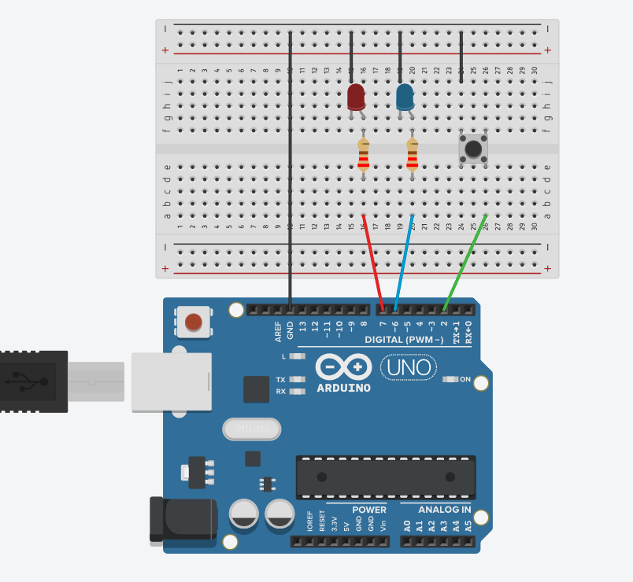

# v1.2
# 🚨 Proyecto 02: Police Lights


Vale, he querido hacer una mejora como ya tenía hecha la luz de emergencia de la policía, he querido meter un botón para activarlo cuando el botón esté pulsado, si no, no.
Entonces, con este proyecto he aprendido cómo poner un botón usando la resistencia de la placa, un `INPUT_PULLUP`.

---

### 🛠️ Componentes que he usado

* **1x Placa de desarrollo** 
* **1x LED Rojo:**
* **1x LED Azul:**
* **1x Pulsador (Botón de 4 patas):** El interruptor para activar la sirena.
* **2x Resistencias:** De 220 o 330 Ohms para proteger los LEDs.
* **Cables de conexión y Protoboard.**

---

### 🔌 El Montaje

Las conexiones van así:

Lo he montado lo más limpio posible para dar al botón y funcionar bien, también he aprendido a controlar y perfeccionar el uso de los botones usando las resistencias de la placa.

1. **El botón:** Siempre que quieras hacer algo así, va en diagonal; pones el cable del pin `D4` a una punta y el contrario a esa punta va al negativo, así de fácil.

2. **Las LEDs:** Siempre con su resistencia de 220 o 330 ohmios. Y conectados a corriente, el LED rojo al `D7` y el LED azul al `D6`.

### Captura del simulador:


### Video mio:


---

### El Código  (v1.2)

Lo más impresionante de todo es que, para que no se vuelva loco el botón con el aire y eso necesita una resistencia, pero es que la placa te deja una resistencia interna para eso y así muchas menos cosas en la protoboard.

Eso se hace con esto: **`INPUT_PULLUP`**. Así te ahorras poner resistencias físicas para el botón en la protoboard. El pin se mantiene estable en `1`, `HIGH` en reposo, y al pulsar baja a `0` (`LOW`) sin interferencias.

```cpp
// C++ code

int button = D5;
int ledRed = D7;
int ledBlue = D6;

void setup()
{
  pinMode(button,INPUT_PULLUP);
  pinMode(ledRed,OUTPUT);
  pinMode(ledBlue,OUTPUT);
}

void loop()
{
 if (digitalRead(button) == LOW)
 	{
   		digitalWrite(ledRed, HIGH);
   		delay(100);
   		digitalWrite(ledRed, LOW);
   		digitalWrite(ledBlue, HIGH);
   		delay(100);
   		digitalWrite(ledBlue, LOW);
 	}
  else
  {
    digitalWrite(ledRed, LOW);
    digitalWrite(ledBlue, LOW);
  }
}
