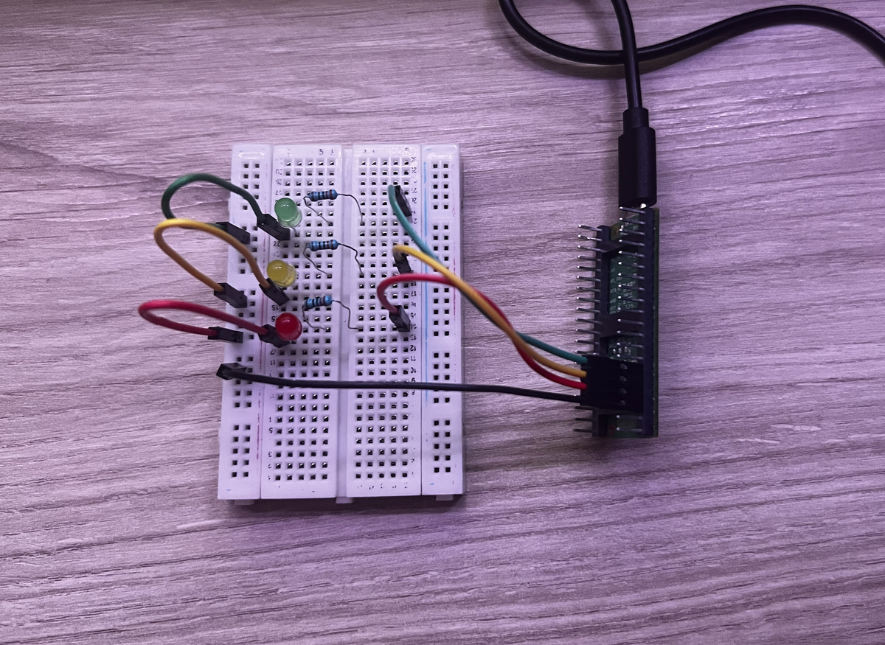

# v1.0
# Proyecto 01: Semáforo

Este es mi primer proyecto con Raspberry Pi Pico 2 W, quiero que sea el primero para aprender más su programación en C++ usando Visual Studio.

### Cómo funciona:

* Cuando le das corriente a la placa, se enciende un bucle de 2 segundos por cada luz.
* Primero con el led verde, 2 segundos encendida y se apaga.
* Segundo con la LED naranja, 2 segundos encendida y se apaga.
* Tercero con la LED roja, 2 segundos encendida y se apaga.
* Y otra vez a comenzar es todo el rato este bucle.

### Aprendido

He aprendido varias cosas, he tenido que aprender otra vez desde 0 la programación de C++ porque yo venía de trabajar en Arduino IDE, que son las mismas funciones, pero se escriben de otra forma. Esto es el resumen por si te sirve: 

| Arduino (IDE) | C++ Puro (Pico SDK) |
| :--- | :--- |
| (Automática) | `#include "pico/stdlib.h"` |
| `const int pin = 13;` | `const uint PIN = 13;` |
| `void setup() { ... }` | `int main() { ... }` |
| `pinMode(pin, OUTPUT);` | `gpio_init(PIN);` + `gpio_set_dir(PIN, GPIO_OUT);` |
| `Serial.begin(9600);` | `stdio_init_all();` |
| `void loop() { ... }` | `while (true) { ... }` |
| `digitalWrite(pin, HIGH);` | `gpio_put(PIN, 1);` |
| `digitalWrite(pin, LOW);` | `gpio_put(PIN, 0);` |
| `delay(1000);` | `sleep_ms(1000);` |

### Imagen Guia::

