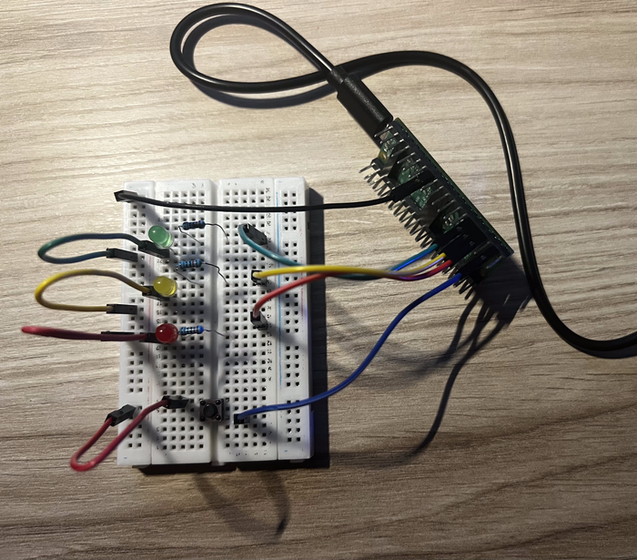

# 01-semáforo - Versión v2.0

> **Objetivo:** En esta version he cambaido algunas cosas, he añadido un boton para que el peaton le de y se ponga en ambar 2 segundos y rojo 6 para que pase y asi de facil.

## Novedades de esta versión
* Se ha añadido un botón de peatones.
* El código usa el if/else.
* He aprendido la librería de INPUT de pines.

## Componentes Necesarios
* 1x Raspberry Pi Pico 2 WH
* 1x botón/pulsador
* 3x LEDs (1x Rojo, 1x Naranja, 1x Verde)
* 3x Resistencias 220Ω
* Cables Dupont y Protoboard de 400 puntos

## Mapa de Pines 
| Componente | Pin de la Pico 2 | Configuración / Uso |
| :--- | :--- | :--- |
| LED Verde | GPIO 11 | Salida OUTPUT |
| LED Naranja | GPIO 12 | Salida OUTPUT |
| LED Rojo | GPIO 13 | Salida OUTPUT |
| Botón | GPIO 14 | Entrada INPUT |

##  Montaje Físico

## ⚙️ Cómo Funciona
1. **Inicio:** Empieza encendiendo el LED verde siempre hasta que pasa el if.
2. **Bucle:** Se mantiene el verde encendido hasta que tocas el boton
3. **Acción:** Al pulsarlo, apagas el verde, enciendes el ámbar 2 segundos y después el rojo 6 segundos. Cuando termina, se enciende el verde otra vez.
